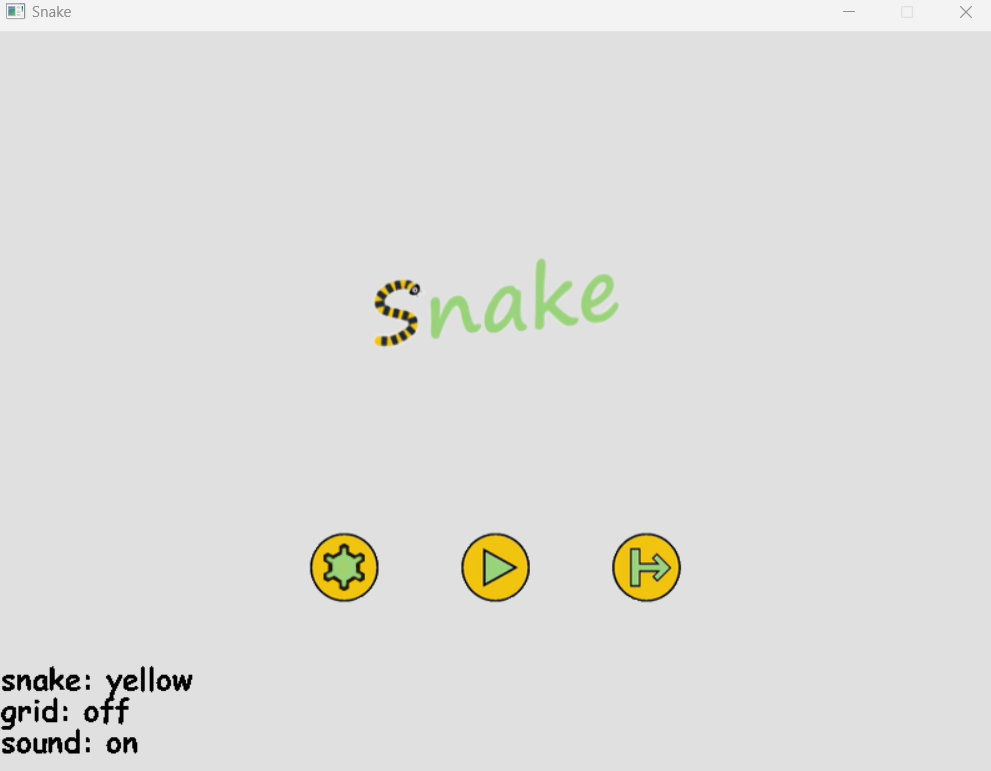
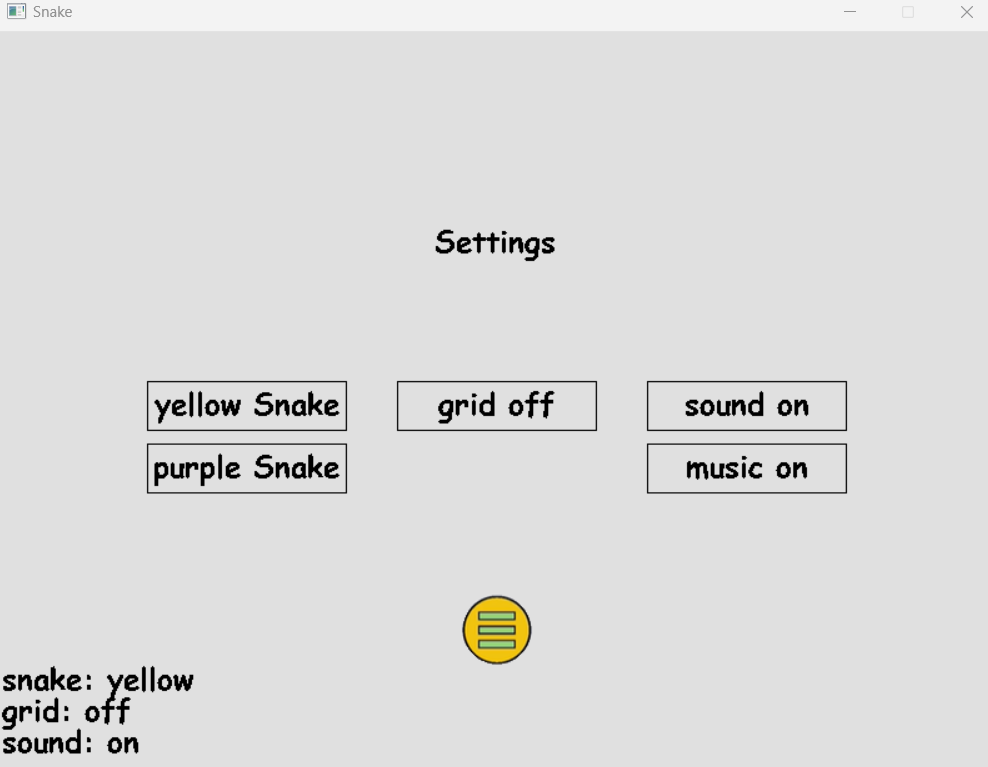
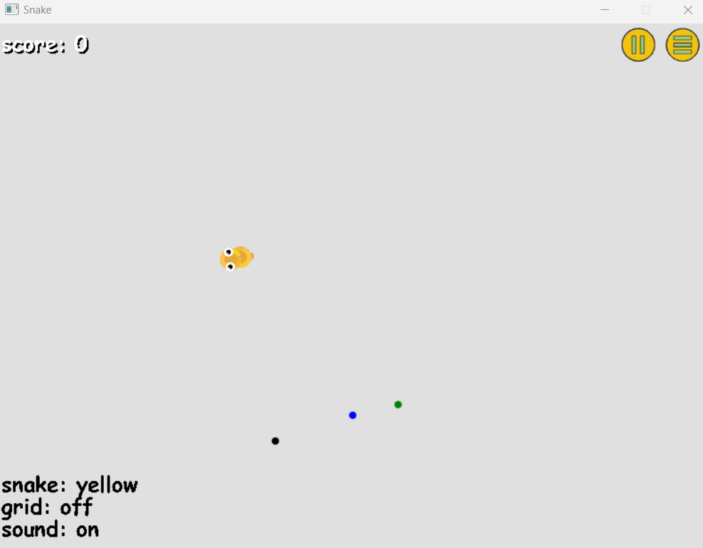
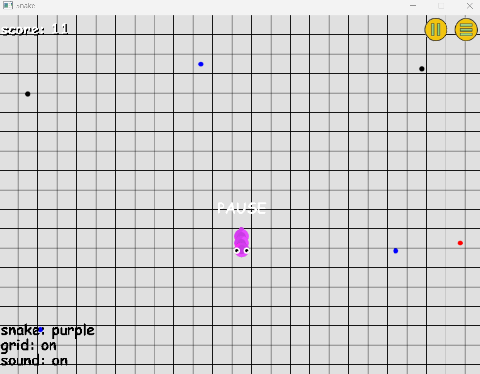
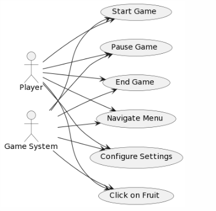
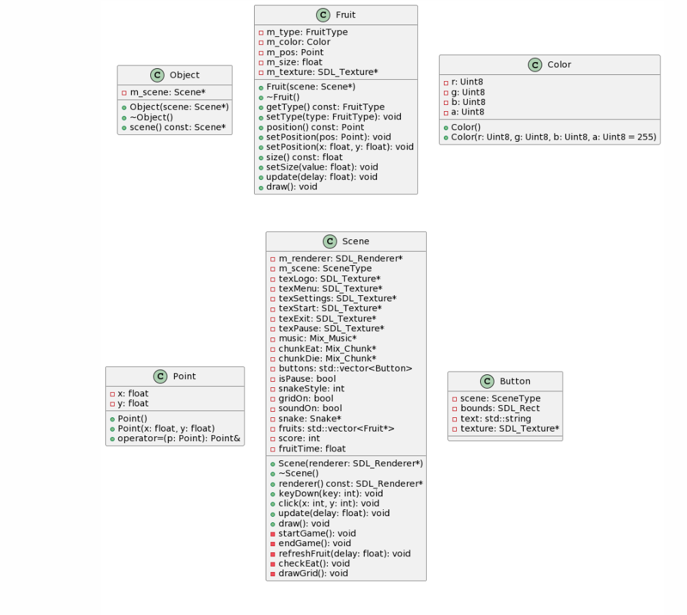
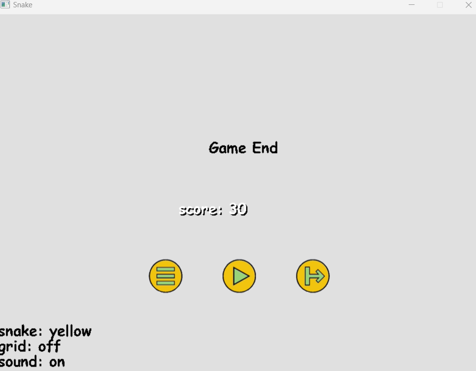

# COMP3016  

# CourseWork1 -- The Urged Snake
## Introduction
Full name of subject: COMP3016 Immersive Game Technologies  
Student number: 10881130  
CW1：Snake Game A console game based on C++ and SDL
## Development Environment
Microsoft Visual Studio Professional 2022 (64 bit) - Current Version 17.7.4  
Operating System Version: Windows 10 Home Chinese version (version number 22H2)
## Description
### Game description and instruction
Player use W A S D or ↑ ↓ ← → to control the movement of the snake. You can also use the mouse to guide the movement direction of the snake. Press and hold the space bar to accelerate. Different fruits correspond to different scores. There are 5 types of games. The upper left corner of the main interface displays the current score. The upper right corner can pause the game. The game ends interface and the main interface. The interface is similar to displaying the snake's score. The middle button is changed to restart the game. For game operation, use W A S D to control the movement of the snake. Long press the space bar to accelerate the mouse to guide the direction of the snake's movement. The characteristics of the snake are that the snake can move in a smooth curve. The end judgment condition is when the snake touches its body length of two meters. When there are more than 1 node, the game will display that the game is over. If you touch your own body, you will die and jump to the end interface
* This is a high imitation of the Snake War game. I have added many new and interesting features to the original game for players to choose freely:
* The player's task is to control the snake and keep it alive as much as possible! Get higher scores! (Each different colored apple has a different score)
  * Black No points
  * Bronw No Points
  * Red 3 Points
  * Blue 2 Points
  * Green 1 Points

* The game is fully functional, allowing players to easily adjust whether to add a grid to the background, choose the color of the snake, exit the game, describe how to play, set a dedicated key to pause the game, and score points
* The background sounds are soft, comfortable, and have special sound effects
* Snake Fight (Remastered Edition) will not disappoint players with its extremely unique new features and graphics，and unlike the previous greedy snakes, it has no boundaries and can freely shuttle through the graphics
    
### Control
| Control   | 1 | 2  |
|--------|------|-----------|
| Up   | W   | ↑     |
| Down   | S   | ↓     |
| Left   | A   | ← |
| Right   | D | →      |

Players can speed up by pressing the space bar  
Mouse clicks evernt can also guide the direction of the snake
## Screen Shot

## UML Design Diagram
use case diagram: 
 
class diagram:

## Exception handling use cases
Before Fix: 
m_nodes.clear(); 
for (int i = 0; i < INIT_NODES; ++i) { 
    m_nodes.push_back(Point(x, y)); 
    //y += 10.0f; 
} 

// Initial direction and velocity 
m_dir = Point(0.0f, -1.0f); 
m_speed = SNAKE_SPEED; 

 
Error Cause:  
The delegate function is bound to the wrong newly generated node and the head is hit 

After Fix: 

m_nodes.clear(); 
m_path.clear(); 
for (int i = 0; i < INIT_NODES; ++i) { 
    Point pos = Point(x, y); 
    m_nodes.push_back(pos); 
    //y += 10.0f; 
} 

// Initial direction and velocitys 
m_dir = Point(0.0f, -1.0f); 
m_speed = SNAKE_SPEED; 

## Video Link
YouTube: https://youtu.be/E-L29phtJP0

## Git Link
GitHub: https://github.com/yuxi95/COMP3016CW1
